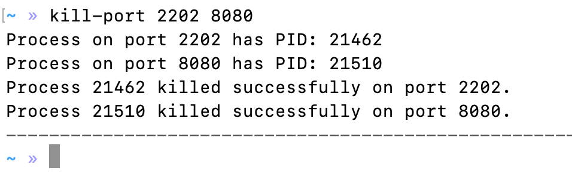
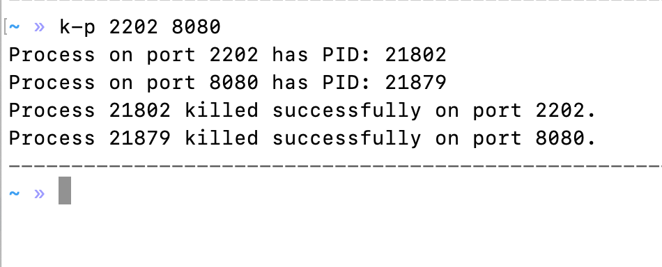

# kill-port-process-cli

A CLI tool to kill processes by port. This tool allows you to terminate processes running on specified ports. It is useful for developers who need to quickly free up ports during development.

## Installation

To install the package globally, use npm:

```bash
npm install -g kill-port-process-cli
```
### Usage
You can use the tool by running the `kill-port` or `k-p` command followed by one or more port numbers.
### example
To kill processes running on ports 3000 and 3001:

```bash
kill-port 3000 3001
```

or
```bash
k-p 3000 3001
```
### Compatibility
This tool is compatible with Windows, macOS, and Linux.
### How It Works
1. The tool identifies the process ID (PID) using the specified port.
2. It then terminates the process associated with that PID.
### Finding the PID
- On Unix-based systems, it uses the `lsof` command.
- On Windows, it uses the `netstat` command.
### Contributing
Contributions are welcome! Please open an issue or submit a pull request.
